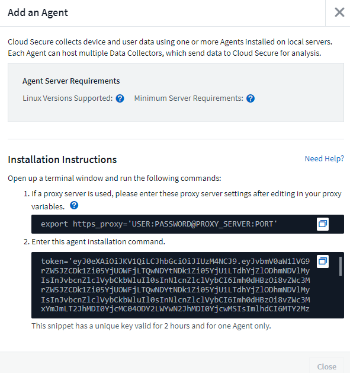

= 安裝過程Cloud Secure
:allow-uri-read: 

[role="lead"]
使用一或多個代理程式收集使用者活動資料。Cloud Secure代理程式會連線至您環境中的裝置、並收集傳送至Cloud Secure 該SaaS層進行分析的資料。請參閱 link:concept_cs_agent_requirements.html["代理程式需求"] 設定代理VM。

== 開始之前

* 安裝、執行指令碼及解除安裝時、都需要使用Sudo權限。
* 安裝代理程式時、會在機器上建立本機使用者_cssy__和本機群組_cssy__。如果權限設定不允許建立本機使用者、而需要Active Directory、則必須在Active Directory伺服器中建立使用者名稱為_cssy__的使用者。

== 安裝代理程式的步驟

. 以系統管理員或帳戶擁有者身分登入Cloud Secure 您的支援環境。
. 在「*安全性*」功能表下、選取「*管理」>「資料收集器」>「代理程式」>「+agent*」
+
系統會顯示「新增代理程式」頁面：

+
image::Add-agent-1.png[新增代理程式1]

. 確認代理伺服器符合最低系統需求。
. 若要驗證代理伺服器是否執行支援的Linux版本、請按一下_versions Supported（i）_。
. 如果您的網路使用Proxy伺服器、請依照Proxy一節中的指示來設定Proxy伺服器詳細資料。
+

. 按一下「複製到剪貼簿」圖示以複製安裝命令。
. 在終端機視窗中執行安裝命令。
. 安裝成功完成時、系統會顯示下列訊息：
+
image::new-agent-detect.png[新代理程式偵測]

.完成後
. 您需要設定 link:task_config_user_dir_connect.html["使用者目錄收集器"]。
. 您需要設定一或多個資料收集器。

== 網路組態

在本機系統上執行下列命令、以開啟Cloud Secure 將由資訊系統使用的連接埠。如果對連接埠範圍有安全顧慮、您可以使用較小的連接埠範圍、例如_35000:35100_。每個SVM使用兩個連接埠。

.步驟
. 「Udo firewall-cmd --fonary --區域=public-add-port=35000-55000/tcp」
. 「Udo firewall-cmd --reload」

依照您的平台執行後續步驟：

* CentOS 7.x / RHEL 7.x *：

. 「Udo iptater-SAVE | grep 35000」

範例輸出：

 -A IN_public_allow -p tcp -m tcp --dport 35000:55000 -m conntrack -ctstate NEW,UNTRACKED -j ACCEPT
* CentOS 8.x / RHEL 8.x *：

. 「Udo firewall-cmd --ZONE =公有-清單連接埠| grep 35000」（適用於CentOS 8）

範例輸出：

 35000-55000/tcp

== 疑難排解代理程式錯誤

下表說明已知問題及其解決方法。

[cols="2*"]
|===
| 問題： | 解決方法： 

| 代理程式安裝無法建立/opp/NetApp/cloudsec/agent/logs/agent.log資料夾、且install.log檔案未提供相關資訊。 | 此錯誤發生於代理程式的開機期間。錯誤並未記錄在記錄檔中、因為它發生在記錄程式初始化之前。錯誤會重新導向至標準輸出、並使用「journalctl -u cloudsecure-agent.service`」命令顯示在服務記錄中。此命令可用於進一步疑難排解問題。 

| 代理程式安裝失敗、無法使用「不支援此Linux套裝作業系統。結束安裝」。 | 當您嘗試在不受支援的系統上安裝代理程式時、就會出現此錯誤。請參閱 link:concept_cs_agent_requirements.html["代理程式需求"]。 

| 代理程式安裝失敗、並顯示錯誤：「-bash: unZip：command not found" | 安裝unzip、然後再次執行安裝命令。如果機器上安裝了Yum、請嘗試「yum install unzip」來安裝unzip軟體。之後、從代理程式安裝UI重新複製命令、然後貼到CLI中、以再次執行安裝。 

| 代理程式已安裝且正在執行。但代理程式突然停止。 | SSH到代理機器。透過「傳送系統狀態cloudsecure-agent.service`」檢查代理程式服務的狀態。1.檢查記錄是否顯示「無法啟動Cloud Secure 支援服務」訊息。2.檢查代理機器中是否存在cssys使用者。以root權限逐一執行下列命令、並檢查cssys使用者和群組是否存在。《Udo id cssys》（《Udo Groups cssys》）3。如果不存在、則集中化監控原則可能已刪除cssys使用者。4.執行下列命令、手動建立cssys使用者和群組。「Udo useradd cssys」「show group」、「cssys」5。之後執行下列命令重新啟動代理程式服務：「Udo systemctl重新啟動cloudsecure-agent.service` 6.如果仍未執行、請檢查其他疑難排解選項。 

| 無法將超過50個資料收集器新增至代理程式。 | 只能將50個資料收集器新增至代理程式。這可以是所有收集器類型的組合、例如Active Directory、SVM和其他收集器。 

| UI顯示代理程式處於「未連線」狀態。 | 重新啟動代理程式的步驟。1.向代理機器SSH。2.執行下列命令、在之後重新啟動代理程式服務：「Udo systemctl restart cloudsecure-agent.service` 3.透過「傳送系統狀態cloudsecure-agent.service`」檢查代理程式服務的狀態。4.代理程式應進入連線狀態。 

| 代理VM位於Zscaler Proxy之後、代理程式安裝失敗。由於Zscaler Proxy的SSL檢查、Cloud Secure 因此當Zscaler CA簽署時、就會顯示出該驗證憑證、因此代理程式不信任該通訊內容。 | 在Zscaler Proxy中停用*.cloudinsights.netapp.com URL的SSL檢查。如果Zscaler執行SSL檢查並取代憑證、Cloud Secure 則無法使用。 

| 安裝代理程式時、解壓縮後安裝會暫停。 | 「chmod 755 -RF」命令失敗。當代理程式安裝命令是由工作目錄中有檔案、屬於其他使用者、且這些檔案的權限無法變更的非root Sudo使用者執行時、命令就會失敗。由於chmod命令失敗、安裝的其餘部分將不會執行。1.建立名為「cloudSecure」的新目錄。2.移至該目錄。3.複製並貼上完整的「tokent=……」 … ．/cloudseced-agent-install.sh」安裝命令、然後按Enter鍵。4.安裝應可繼續進行。 

| 如果代理程式仍無法連線至SaaS、請透過NetApp支援開啟案例。提供Cloud Insights 「不完整」序號以開啟案例、並將記錄附加到案例中、如前所述。 | 若要將記錄附加至案例：1.以root權限執行下列指令碼、並共用輸出檔案（cloudseced-agent-症狀。zip）。答/opp/NetApp/cloudsec/agent/bin/cloudsecure-agent-symptom-collector.sh 2.以root權限逐一執行下列命令、並共用輸出。答ID cssys b.群組cssys c.Cat /etc/os-release 

| cloudsecure-agent-symptom-collector.sh指令碼失敗、並出現下列錯誤。[root@machine tmp]#/opt/NetApp/cloudecure/agent/bin/cloudsecure-agent-symptom-collector.sh收集服務記錄收集應用程式記錄收集代理程式組態擷取服務狀態快照擷取代理程式目錄結構快照………………………………………………………………… 。……………………………… 。/opt/NetApp/cloudecure/agent/bin/cloudecure-agent-症狀 收集器.sh：第52行：郵遞區號：找不到命令錯誤：無法建立/tmp/cloudsecure-agent-symptoms.zip | 未安裝Zip工具...執行命令「yum install zip」來安裝壓縮工具。然後再次執行cloudsecure-agent-symptom-collector.sh。 

| 使用useradd安裝代理程式失敗：無法建立目錄/home/cssys | 如果因為缺乏權限而無法在/home下建立使用者的登入目錄、就可能發生此錯誤。因應措施是建立cssys使用者、然後使用下列命令手動新增其登入目錄：_Sudo useradd usern_name -m -d home_DIR_-m：如果使用者的主目錄不存在、請建立該使用者的主目錄。d：使用home_DIR建立新使用者、做為使用者登入目錄的值。例如、_Sudo useradd cssys -m -d /cssys_會新增使用者_cssys_、並在root下建立其登入目錄。 

| 代理程式在安裝後未執行。_Systemctl狀態cloudsecure-agent.service_顯示下列項目：[root@demo ~]# systemctl狀態cloudsecure-agent.service agent.service–Cloud Secure 已載入支援的Agent DaemonService：Loaded（usr/lib/systemd/system/cloudsecure-agent.service;已啟用；Vendor preset：停用）Active：啟動（自動重新啟動）（結果：exit-code-Code）自Tue 2021：08：21：12：26；雙子程序：26；2s前：25 x ecbash/cloudbid=25 x 9=clouvid/clouecbid/bid/pin安全登入/登入程式碼/clouecbid/clam/pin（ 25889（code=eded、STATUS=126）、08月03日21：12：26展示系統d[1]：cloudsecure-agent.service:主要程序已結束、code=ed退出、STATUS=126/n/a 8月03日21：12：26展示系統d[1]：單位cloudsecure-agent.service進入失敗狀態。03年8月21日12：26示範系統d[1]：cloudsecure-agent.service失敗。 | 這可能是因為_cssys_使用者可能沒有安裝權限而失敗。如果/opp/netapp是NFS掛載、而且_cssy__使用者無法存取此資料夾、安裝將會失敗。_cssy__是Cloud Secure 由該安裝程式所建立的本機使用者、可能沒有存取掛載共用的權限。您可以嘗試使用_cssys_使用者來存取/opp/NetApp/cloudsec/agent/in/cloudseced-Agent來檢查此問題。如果傳回「權限遭拒」、表示安裝權限不存在。安裝在機器本機的目錄上、而非掛載的資料夾。 

| 代理程式一開始是透過Proxy伺服器連線、並在代理程式安裝期間設定代理。現在Proxy伺服器已經變更。如何變更代理程式的Proxy組態？ | 您可以編輯agent.properties以新增Proxy詳細資料。請遵循下列步驟：1.變更至內含內容檔案的資料夾：CD /opp/netapp/cloudsec/conf2。使用您最愛的文字編輯器、開啟_agent.properties_檔案進行編輯。3.新增或修改下列行：agent_proxy_host=scspa1950329001.vm.netapp.com agent_proxy_port=80 agent_proxy_user=pxuser agent_proxy_password=pass12344.儲存檔案。5.重新啟動代理程式：Sudo systemctl重新啟動cloudsecure-agent.service 
|===